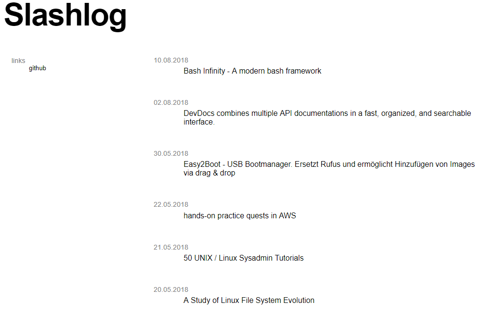

# bashblog

tatic blog generator. Super simple. Nothing fancy, just a list of links and short notes.<br />
Publish via shell or email to collect and share links with a short text.

It takes less than 30 seconds to publish a new entry via terminal:

[](https://asciinema.org/a/146946)

Generated Website:

[


## Features
Entries are grouped by the date of its import. Each entry has 3 features
- URL
- title
- tag(s)

An entry consists of only one link. The text of this link is the title.

### Modules
It is possible to extend the features via modules (or translators)
Modules:
- ```translator_youtube``` This module translates youtube urls to embedded youtube videos. When this module is active all imported youtube urls are shown as embedded videos.

## Getting Started

These instructions will guide you though installing your own blog. It is at a vry young age, so please expect undocumented parts.

### Prerequisites

Software needed
- xmlstarlet

`sudo apt-get install xmlstarlet`
- sed

`usually installed`
- xml_grep, (included in xml-coreutils)

Please see: [http://xml-coreutils.sourceforge.net/] instructions will follow.

### Installing

Download the branch ```master``` to your webserver.<br />It doesn't need to be in the webserver's folder. ```~/bin/```could be a possible path. You need to be able to execute the scripts - ```chmod``` them to your needs.

Copy ```config/config_template.conf``` to ```config/config.conf``` and change the first lines accordingly(follow instructions in the file).<br />Run ```install.sh```. It will create required folders.
It's possible that you still have to chown the files in your webserver folder to e.g. www-data in order to publish it.


### Usage
#### Write entry via command line

[](https://asciinema.org/a/146946)


To publish an entry just run ```input_entry.sh```.

The script asks for ```URL```, ```Text```and ```Tag(s)```.<br />
Please seperate tags with ```,```. <br />
Hit <ENTER> to publish the entry!

#### Write entry via email
It is possible to import entries through RSS. E-Mail import is currently done by a external service like zappier - the service scrapes an known inbox and generates an RSS feed. This feed is scraped by ```mail.sh```and is generating entries out of the feed.
The usag is simple
- ```E-Mail subject``` = Entry title
- ```E-Mail body``` = Entry URL
- Tags are not supported yet

Zappier generates an ID per email. This ID is stored in ```config/ids.txt``` and checked in the import script. Entries are grouped by the date the script is triggered.
After import the script generates a new ```index.html``` itself.

*Setup Zappier*

…todo

*Config URL*

add url to `mail.sh`

#### Autoimport via cronjob
To autoimport entries via RSS just add mail.sh to your crontab.

In Terminal: ```crontab -e```

Add line: ```*  *  * * * cd "ADD-INSTALL-PATH-HERE" && ./mail.sh >> ./temp/cronlog.txt```

This will run the import every minute. See e.g. [crontab.guru](https://crontab.guru) for different settings.

The script loggs to /temp/cronlog.txt.

#### Add links to the menu

A simple menu is generated by scraping the files in `$html_path/config/menu/link/`

To add a link, just place one file per link to the `link` folder.<br />
File-name = Text in menu<br />
File-content = URL (including "http://"!)

E.g.:<br />
File-name = `google`<br />
File-content = `http://www.google.de`


## Running tests

There are no automated tests. Run ```input_entry.sh``` (for manually importing a new entry) or ```mail.sh``` (for importing via RSS) after changing the code. Both scripts run ```beitraggenerieren.sh``` and ```generate_index.sh``` after importing new entries.
When testing ```mail.sh``` make sure you delete email IDs in ```ids.txt``` to use the same test-mails again.

The test succeeded when
1. the entry is imported in ```/html/entries/```,  
2. the entry is in ``ìndex.html```
3. all parts of the entry are as they should be (url clickable, text and tag are presend)

## Contributing

I have not yet thought about others contributing to the project. We'll figure it out as soon as someone is interested in contributing(please file an issue or contact me via [twitter](https://twitter.com/6uhrmittag)).

## Code

See the code at [https://github.com/6uhrmittag/bashblog](https://github.com/6uhrmittag/bashblog).

## Live

See the code live at [blog.slashlog.org](https://blog.slashlog.org).

## Authors

* **Marvin Heimbrodt** - *Initial work* - [@6uhrmittag](https://twitter.com/6uhrmittag)
